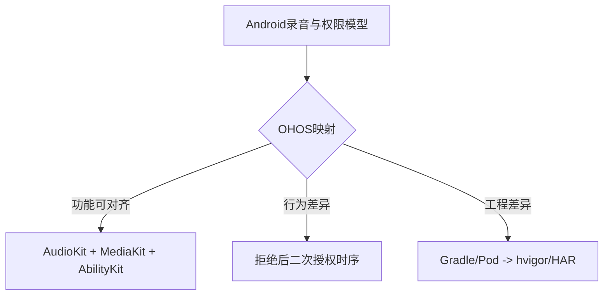

# flutter_audio_recorder 鸿蒙化可行性分析报告（ohos-library-migration-analyzer）

## 1. 库概述分析

- 三方库名称：`flutter_audio_recorder`
- 开源协议：MIT
- 技术栈：Flutter(Dart) + Android(Java) + iOS(ObjC/Swift) + OHOS(ArkTS/ETS)
- 目标能力：录音初始化、开始/暂停/恢复/停止、状态轮询、电平计量、权限申请
- 当前状态：仓库已经包含 `ohos` 目录与可用 ArkTS 插件实现，属于“已完成基础鸿蒙化并进入稳定化阶段”

核心特性：
- 支持 `.wav/.m4a/.mp4/.aac` 多容器格式
- 支持录音过程计量（`peakPower/averagePower`）
- 支持权限检查及二次授权流程

典型应用场景：
- 语音采集类应用（备忘录、工单、语音输入）
- 需要跨平台一致 API 的录音插件场景

## 2. 目录结构分析

| 路径 | 类型 | 功能说明 |
|------|------|----------|
| `lib/` | 目录 | Dart 层插件 API 封装（MethodChannel） |
| `android/` | 目录 | Android Java 侧录音实现 |
| `ios/` | 目录 | iOS ObjC/Swift 侧录音实现 |
| `ohos/` | 目录 | OpenHarmony ArkTS 侧插件实现（HAR） |
| `example/` | 目录 | 示例应用（Android/iOS/OHOS） |
| `example/ohos/` | 目录 | 示例鸿蒙工程（entry + hvigor） |
| `test/` | 目录 | Dart 层测试 |
| `README.OpenHarmony_CN.md` | 文件 | 鸿蒙侧说明文档 |
| `pubspec.yaml` | 文件 | 插件元数据与平台声明 |

## 3. 代码量统计

说明：环境缺少 `cloc`，使用脚本按后缀粗略统计（含注释/空行）。

| 语言 | 文件数 | 行数 |
|------|--------|------|
| ArkTS/ETS | 10 | 1614 |
| Dart | 4 | 775 |
| Java | 3 | 508 |
| Swift | 2 | 224 |
| JSON5 | 11 | 239 |
| Gradle | 5 | 155 |
| TypeScript | 4 | 122 |
| ObjC | 2 | 36 |
| 其他（Markdown/YAML） | 10 | 654 |
| **总计** | **51** | **4327** |

结论：项目规模中等，鸿蒙侧复杂度主要集中在 `ohos/src/main/ets/components/plugin/FlutterAudioRecorderPlugin.ets`。

## 4. 依赖分析

### 4.1 Flutter/第三方依赖

插件主包（`pubspec.yaml`）：
- `flutter`（SDK）
- `path: ^1.5.1`

示例包（`example/pubspec.yaml`）：
- `flutter_audio_recorder`（path 本地依赖）
- `audioplayers`（git）
- `path_provider`（git）

### 4.2 系统层依赖

| 依赖项 | 用途 | OHOS 对应能力 |
|--------|------|---------------|
| Android `AudioRecord` | PCM 采集 | `@kit.AudioKit` `AudioCapturer` |
| Android `MediaRecorder` | AAC/容器录制 | `@kit.MediaKit` `AVRecorder` |
| Android 权限接口 | 运行时授权 | `@kit.AbilityKit` |
| Java 文件 IO | 临时文件与转存 | `@kit.CoreFileKit` |

### 4.3 OHOS 工程依赖

| 依赖库 | 来源 | 用途 | 结论 |
|--------|------|------|------|
| `@ohos/flutter_ohos` | `oh-package.json5` 本地 file 依赖 | Flutter 运行时桥接 | 必需 |
| `ohos.permission.MICROPHONE` | `entry/module.json5` | 录音授权 | 必需 |
| `ohos.permission.INTERNET` | `entry/module.json5` | 示例网络能力 | 可按需保留 |

依赖结论：
- 主插件依赖轻量，可行性高
- 风险点主要在示例工程外部 git 依赖版本漂移

## 5. 构建系统分析

| 构建项 | 原方案 | OHOS 方案 | 迁移说明 |
|--------|--------|-----------|----------|
| Flutter 插件构建 | pub + Gradle/CocoaPods | pub + hvigor | 已打通 |
| OHOS 模块类型 | 无 | HAR（`module.type=har`） | 已实现 |
| 产物 | `.aar` / Pod | `.har`（插件）+ `.hap`（示例） | 已实现 |
| 依赖管理 | Maven/Pod/pub | oh-package/hvigor/pub | 已实现 |

结论：构建链路完整，可直接进入稳定性与工程化优化阶段。

## 6. 权限分析

| 平台权限 | 用途 | OHOS 对应 | 支持情况 |
|----------|------|-----------|----------|
| `android.permission.RECORD_AUDIO` | 麦克风采集 | `ohos.permission.MICROPHONE` | 支持 |
| `android.permission.WRITE_EXTERNAL_STORAGE`（示例） | 文件写入 | OHOS 沙箱目录写入 | 需按目录策略评估 |
| 拒绝后再授权 | 二次授权交互 | `requestPermissionOnSetting` | 已支持 |

结论：权限迁移已完成，当前实现具备首次授权+二次授权+跨进程状态恢复。

## 7. 鸿蒙化方案分析

### 7.0 语言运行时兼容性

- Java/ObjC/Swift 不能在 OHOS NEXT 直接复用
- 该库已通过 ArkTS 实现 OHOS 插件主体，满足运行时约束

### 7.1 平台差异对比

| 原平台接口/功能 | 用途 | OHOS 对应接口 | 差异说明 | 适配难度 |
|----------------|------|---------------|----------|----------|
| `AudioRecord` | PCM 录音 | `audio.AudioCapturer` | 生命周期与 read loop 逻辑不同 | 中 |
| `MediaRecorder` | AAC 录音 | `media.AVRecorder` | 容器/编码参数模型不同 | 中 |
| `requestPermissions` | 首次授权 | `requestPermissionsFromUser` | 返回结构与时序不同 | 中 |
| 设置页授权 | 二次授权 | `requestPermissionOnSetting` | 需要持久化状态控制触发时机 | 中 |
| Java File API | 文件读写 | `fileIo` | fd 管理方式不同 | 中 |

### 7.2 ArkTS约束与API Level兼容

- 当前 ArkTS 代码未见高风险动态执行特性（如 `eval/new Function`）
- 已实现 `.aac` 的 API Level 判断与错误提示
- 建议补充“容器格式-API Level”兼容矩阵到文档

### 7.3 鸿蒙化修改方案（增量）

- 代码结构优化：
  - 拆分权限状态机、录音格式策略、文件策略模块
- 稳定性优化：
  - 固化示例外部依赖版本
  - 补齐权限拒绝/杀进程恢复/二次授权回归用例
- 文档优化：
  - 标注不同容器格式与 API Level 的支持边界

### 7.4 可行性评估

- 技术可行性：高
- 接口覆盖度：约 95%
- 功能完整性：大部分完整
- 综合结论：推荐（当前重点为稳态化优化，不是从零迁移）

### 7.5 工作量评估

| 工作项 | 工作内容 | 复杂度 | 预计工时 |
|--------|----------|--------|----------|
| 权限模块化与兜底 | 权限状态机拆分、异常分支补齐 | 中 | 1~2 人天 |
| 录音兼容增强 | 容器与采样率兼容回归 | 中 | 2~3 人天 |
| 示例依赖治理 | 锁定 commit，减少漂移 | 中 | 1~2 人天 |
| 自动化回归 | 权限时序 + 多格式录音回归 | 中 | 2~3 人天 |
| 文档更新 | 兼容矩阵、限制说明、FAQ | 低 | 0.5~1 人天 |
| **总计** |  |  | **6.5~11 人天** |

## 8. 风险分析

| 风险类型 | 风险点描述 | 影响程度 | 建议措施 |
|----------|-----------|----------|----------|
| 依赖风险 | 示例依赖 git 库版本不稳定 | 中 | 固定 commit + CI 检查 |
| 兼容风险 | 不同 API Level 对 `.aac` 行为差异 | 中 | 保留版本判断与降级策略 |
| 交互风险 | 系统设置页回跳时序差异 | 中 | 增强状态校验与重入保护 |
| 维护风险 | 核心逻辑集中在单文件 | 中 | 分层重构并补单测 |
| 性能风险 | 长时录音 IO 与计量频率开销 | 低 | 优化采样频率与写盘策略 |

## 9. 总结

基于当前代码与构建结构，`flutter_audio_recorder` 的鸿蒙化可行性评估为“高”。核心能力已可在 OHOS 运行，后续主要是工程化增强：稳定依赖、强化回归、模块化重构。建议按一轮 `6.5~11` 人天的计划完成稳态收敛后进入长期维护。

